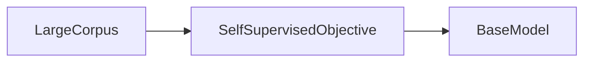
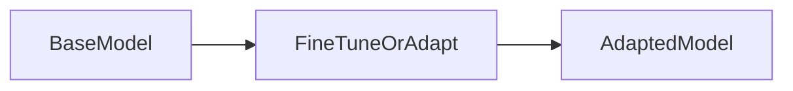

# 01 — Pre-training and fine-tuning

## In one minute

A large language model (LLM) is first **pre-trained** on huge general text so it learns broad language and world patterns. **Fine-tuning** then adjusts that same model—using smaller, more focused data—so it follows instructions, matches a domain, or adopts a style, without always retraining from scratch.

## Beginner walkthrough

1. **Data at scale**  
   Pre-training uses massive corpora (books, web text, code, etc.). The objective is usually **self-supervised**: the model predicts missing tokens or next tokens, so labels come from the text itself.

2. **What “pre-trained” means**  
   After pre-training you have a **base model**: strong at language, but not necessarily safe, instruction-following, or specialized for your company’s jargon.

3. **What fine-tuning adds**  
   Fine-tuning continues training (or adds small trainable parts) with **curated data**: instructions and answers, medical Q&A, legal drafting, chat logs, and so on. The model keeps most of what it learned pre-training and **specializes**.

4. **Why this order matters**  
   Pre-training is expensive once; fine-tuning is cheaper per use case. Later folders explain how **quantization** and **parameter-efficient** methods make specialization affordable.

## Visuals

**From raw text to a base model**

**From base model to an adapted model**

## Going deeper

- **Continued pre-training (CPT)** vs **supervised fine-tuning (SFT)** vs **preference tuning**: same umbrella “after pretrain,” different data and objectives. RLHF (folder 14) is another post-pretrain stage.
- **Catastrophic forgetting** can appear if fine-tuning updates too many weights too aggressively (folder 15)—reason PEFT and LoRA exist.
- **Compute**: pre-training often uses thousands of GPUs for weeks; fine-tuning might use tens to hundreds of GPUs—or one consumer GPU with QLoRA (folder 10).

## Mini glossary

| Term | Meaning |
|------|---------|
| Self-supervised learning | Training signal invented from raw data (e.g. predict next token). |
| Base model | Post-pretrain checkpoint before instruction or safety tuning. |
| Fine-tuning | Further training to adapt behavior or domain. |

## What to read next

**[02 — Quantization overview](../02-quantization/01-overview.md)** — why billion-parameter models push you toward lower precision and smaller footprints.
