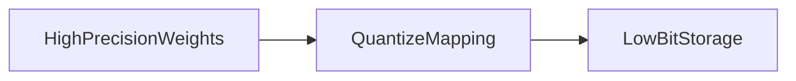

# Quantization overview

**Quantization** stores weights (and sometimes activations) in **fewer bits** than FP32/FP16 so the model uses less memory, runs faster on many devices, and costs less to host. You still have to scale things carefully or quality takes a hit.

1. **What is being reduced?**  
   Neural nets are arrays of numbers. By default training often uses **FP32** (32-bit float) or **FP16/BF16** (16-bit). Quantization maps many of those values to **int8** or even **int4** for storage and some math paths.

2. **Why it matters for LLMs**  
   A 7B or 70B model has billions of weights. Cutting average storage from 16 bits to 4–8 bits can shrink **disk and RAM** a lot, which also improves **batch size** and **latency** on GPUs and enables **edge** devices.

3. **What you trade**  
   Fewer bits means **rounding error**. Aggressive quantization without calibration or QAT can hurt accuracy; later notes show how engineers recover quality.

4. **Weights vs activations**  
   **Weight quantization** is most common in LLM compression. **Activation quantization** saves memory during inference but is trickier because activations change per input.

5. **Concrete example (uint8, min–max)**  
   If you map real weights in **[0, 1000]** onto **0…255**, the scale is **1000 / 255 ≈ 3.92** “real units per integer step,” then each weight is `round(weight / 3.92)`. Step-by-step table (same numbers) is in [symmetric quantization](02-symmetric-quantization.md) under **Full hand example**.

| Storage / compute | Bits | Typical role |
|-------------------|------|----------------|
| FP32 | 32 | Reference training numerics; heavy. |
| FP16 / BF16 | 16 | Common training and inference on GPU. |
| INT8 | 8 | Inference speedups; PTQ/QAT targets. |
| INT4 | 4 | Aggressive LLM weight packing (often with methods like NF4 in practice). |

## Extras

- **Per-tensor vs per-channel**: one scale per whole tensor is simple; per-channel (per output channel) often preserves accuracy for conv layers; LLM linear layers use schemes like **per-group** scales in GPTQ/AWQ-style methods.
- **Symmetric vs asymmetric**: the next two notes—symmetric is simpler; asymmetric handles biased ranges (e.g. mostly positive with a small negative tail).
- **Fake quant in QAT**: during training, values are rounded as if quantized but gradients still flow—QAT section.

## Terms

| Term | Meaning |
|------|---------|
| FP32 / FP16 / BF16 | Floating-point formats with different exponent/mantissa tradeoffs. |
| INT8 / INT4 | Integer storage; values live in a mapped range with a scale (and maybe zero-point). |
| Calibration | Running representative data to pick ranges/scales before PTQ. |

Next: [Symmetric quantization](02-symmetric-quantization.md) — the first concrete mapping from real numbers to integer bins.
