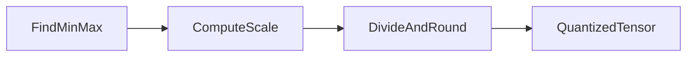

# 03 — Symmetric quantization

## In one minute

Pick the **smallest** and **largest** value a tensor can take, stretch or shrink that interval onto the integer range you have (for example 0–255), then **round**. That stretch factor is the **scale**. Symmetric schemes often map zero in floats to zero in integers—simple, but not always flexible enough.

## Beginner walkthrough

1. **Range determination**  
   For a weight tensor (or a channel), estimate \(r_{\min}\) and \(r_{\max}\) from weights or from running **calibration** data for activations.

2. **Choose integer range**  
   For **uint8**, \(q_{\min}=0\), \(q_{\max}=255\).

3. **Scale (min–max)**  
   \[
   s = \frac{r_{\max} - r_{\min}}{q_{\max} - q_{\min}}
   \]

4. **Quantize a single weight**  
   \[
   q = \mathrm{round}\left(\frac{w}{s}\right)
   \]  
   (In pure symmetric centered-at-zero formulations you may see variants with clipping; the min–max story matches your notes.)

5. **Notebook-style numeric example**  
   If real weights lie in \([0, 1000]\) and uint8 uses \([0,255]\):  
   \[
   s = \frac{1000 - 0}{255 - 0} = \frac{1000}{255} \approx 3.92
   \]  
   Then \(q = \mathrm{round}(w / 3.92)\).

## Visuals

**Number-line intuition (ASCII)**

```
Real weights:     0 --------------------------- 1000
                       \___ scale s ~ 3.92 ___/

Quantized uint8:  0 ---- ... ---- 255
                  qmin              qmax
```

**Pipeline**



## Going deeper

- **Outliers** dominate min–max: one huge weight widens the range and wastes integer buckets. Practitioners use **percentile** ranges, **smoothing**, or per-group scales.
- **Dequantization** for compute: stored as \(q\), used as \(\tilde{w} \approx s \cdot q\) when multiplying with activations in higher precision.
- **Signed symmetric** (e.g. int8 with zero at center) is common in hardware; your notes emphasized uint8 mapping—same idea with different \(q_{\min}, q_{\max}\).

## Mini glossary

| Term | Meaning |
|------|---------|
| Scale \(s\) | Real-world span of one integer step. |
| Min–max quantization | Range from observed min and max. |
| Calibration | Data-driven min/max estimation for activations or weights. |

## What to read next

**[04 — Asymmetric quantization](03-asymmetric-quantization.md)** — when the float range is not a simple interval anchored the way uint8 symmetry expects.
