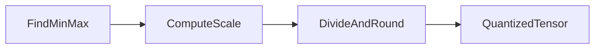

# Symmetric quantization

**Idea in one sentence:** pick how big your real weights can get, map that range onto integers (here **0…255** for uint8), divide by a **scale** so each integer step means a fixed chunk of the real line, then **round**.

---

### What each letter means (no math yet)

| symbol | plain meaning |
|--------|----------------|
| w | one real weight (float) before quant |
| q | the small integer code you store (0…255 here) |
| r_min, r_max | “we believe weights live between these two floats” (from the tensor or from calibration data) |
| q_min, q_max | ends of the integer shelf (for uint8: 0 and 255) |
| s | **scale** — how many real units one tick of q covers |

---

### 1. Find the float range

Look at the tensor (or run a few calibration batches for activations). That gives you **r_min** and **r_max**.

---

### 2. Integer shelf (uint8)

You only have 256 slots:

- **q_min = 0**
- **q_max = 255**

---

### 3. Scale (min–max) — the fraction, written so you can read it

You are stretching **(r_max − r_min)** real units across **(q_max − q_min)** integer steps.

**Scale s (three equivalent ways to read the same thing):**

```
                    (r_max − r_min)          how wide floats are
        s  =  ─────────────────────  =  ───────────────────────────
                    (q_max − q_min)        how many int steps you use
```

**Numbers only, uint8:** bottom is always **255 − 0 = 255**, so:

```
                    (r_max − r_min)
        s  =  ─────────────────────
                           255
```

**In plain English:**  
scale = **(widest float − smallest float) ÷ (255 − 0)** for uint8.

---

### 4. Turn one weight into an integer code

**Quantize one weight w into integer q:**

```
                    w
        q  =  round ( ─ )
                    s
```

**In plain English:** divide the real weight by the scale, then round to the nearest whole number. That whole number is your stored code **q**.

If rounding overshoots **0…255**, **clamp** back into range.

---

### 5. Full hand example (the one I always walk through)

**Assumption:** every weight in this tensor sits in **[0, 1000]** (so r_min = 0, r_max = 1000).  
**Storage:** uint8, so q_min = 0, q_max = 255.

**Step A — scale**

```
                    1000 − 0       1000
        s  =  ──────────────  =  ─────  ≈  3.9216
                    255 − 0        255
```

So **one uint8 step ≈ 3.92 units** on the real weight line.

**Step B — quantize a few weights** (same formula: **q = round(w ÷ s)**)

| real weight w | w ÷ s (before round) | uint8 q (after round + clamp) |
|---------------|----------------------|--------------------------------|
| 0 | 0.00 | 0 |
| 100 | 25.50 | **26** |
| 500 | 127.50 | **128** |
| 1000 | 255.00 | **255** |

**Step C — roughly go back to float (dequantize)**  
If you only need “good enough” float weights for a matmul:

```
    w_reconstructed  ≈  s × q
```

(some people write **w̃** for “approximate w after dequant”.)

| q | s × q ≈ reconstructed float |
|---|-------------------------------|
| 0 | 0 |
| 26 | 26 × 3.9216 ≈ **102.0** (wanted 100 — rounding error) |
| 128 | 128 × 3.9216 ≈ **502.0** (wanted 500) |
| 255 | 255 × 3.9216 ≈ **1000.0** |

So you see the trade: **small integers on disk**, **small error** if the range was honest.

Number line sketch:

```
Real weights:     0 --------------------------- 1000
                       \___ scale s ~ 3.92 ___/

Quantized uint8:  0 ---- ... ---- 255
                  qmin              qmax
```

Pipeline:



---

### 6. Dequantize (when kernels want floats again)

Stored: integer **q**. Used in math: approximate float

```
    w_reconstructed  =  s × q
```

so **w_reconstructed ≈ w** up to the error you saw in the table.

---

## Extras

- **Outliers** blow up r_max → huge s → fat rounding steps. That is why people use percentiles / per-group scales in real PTQ.
- **Signed int8** “symmetric around zero” is the same story with different q_min, q_max; I used uint8 here because the arithmetic fits on one line.

---

## Terms

| Term | Meaning |
|------|---------|
| Scale s | Real-world thickness of one q tick (here from min–max). |
| Min–max quantization | r_min, r_max from observed min and max. |
| Calibration | Run data to estimate ranges for activations or weights. |

Next: [Asymmetric quantization](03-asymmetric-quantization.md) — add a zero-point when the float range is skewed.
