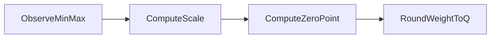

# 04 — Asymmetric quantization

## In one minute

When float values span an interval that does **not** line up cleanly with your integer range (for example negatives and positives skewed toward one side), you still use a **scale**, but you also add a **zero-point**: an integer that corresponds to “real value zero” after mapping.

## Beginner walkthrough

1. **Why asymmetric appears**  
   Weights or activations might run from **negative to positive** with unequal tails, e.g. \((-20, 1000)\) while uint8 can only represent \(0..255\). A single scale-only mapping would waste precision or clip badly.

2. **Scale (same min–max formula as before)**  
   \[
   s = \frac{x_{\max} - x_{\min}}{q_{\max} - q_{\min}}
   \]  
   Example from notes: \(x\in[-20,1000]\), uint8 \(q\in[0,255]\):  
   \[
   s = \frac{1000 - (-20)}{255 - 0} = \frac{1020}{255} = 4
   \]

3. **Zero-point**  
   \[
   z = \mathrm{round}\left(q_{\min} - \frac{x_{\min}}{s}\right)
   \]  
   Intuition: shift the integer grid so the “real zero” lands on an allowed integer.

4. **Quantize**  
   \[
   q = \mathrm{round}\left(\frac{w}{s} + z\right)
   \]  
   (Equivalently \(q = \mathrm{round}(w/s) + z\) when \(z\) absorbs the offset in some notations—stay consistent within one codebase.)

5. **Dequantize (for math)**  
   \(\tilde{w} \approx s \cdot (q - z)\) is the usual inverse story at inference.

## Visuals

**Zero-point as a shift between ranges (ASCII)**

```
Real axis:        xmin=-20 -------- 0 -------- xmax=1000

Quantized axis:  qmin=0 --- z --- ... ------------- qmax=255
                         ^zeroPointMarksRealZero
```

**Steps**



## Going deeper

- Integer \(z\) must stay inside \([q_{\min}, q_{\max}]\); implementations **clamp** after rounding.
- Asymmetric per-channel scales are standard in CNN INT8; LLM PTQ often uses more elaborate formats (GPTQ, AWQ) because outliers break naive min–max.
- **Symmetric** is the special case where \(z\) is chosen so the mapping is symmetric around zero in a signed grid—folder 03.

## Mini glossary

| Term | Meaning |
|------|---------|
| Zero-point | Integer encoding of real value 0 after affine quant mapping. |
| Affine quantization | \(q \approx w/s + z\) style mapping (scale + shift). |

## What to read next

**[05 — Post-training quantization (PTQ)](04-post-training-quantization-ptq.md)** — apply symmetric or asymmetric mapping to a model that is already trained.
