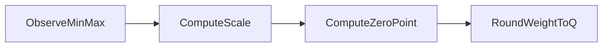

# Asymmetric quantization

**Idea in one sentence:** same as symmetric (pick a scale **s**), but if the float blob is **lopsided** you also pick an integer **z** (zero-point) so “real zero” lands on a valid code instead of being jammed into a corner.

---

### Symbols

| symbol | plain meaning |
|--------|----------------|
| w | real weight |
| q | stored integer code |
| x_min, x_max | observed float range (same job as r_min, r_max in the symmetric note) |
| s | scale |
| z | zero-point (integer) — which code means “float was 0” |

---

### 1. Why skew matters

Say floats mostly live from **−20** up to **+1000**, but you still only have **0…255** integers. If you only divide by s, you waste codes or clip. The **shift z** fixes the alignment.

---

### 2. Scale (min–max, same fraction as symmetric)

```
                    (x_max − x_min)
        s  =  ─────────────────────
                    (q_max − q_min)
```

**Concrete range:** x runs from **−20** to **1000**, uint8 codes **0** through **255**.

```
                    1000 − (−20)       1020
        s  =  ───────────────────  =  ─────  =  4
                       255 − 0           255
```

**In plain English:** each uint8 step covers **4** units on the real line for this tensor.

---

### 3. Zero-point

**Formula (then I plug numbers in on the next line):**

```
                              x_min
        z  =  round ( q_min − ───── )
                                s
```

**Plug in:** q_min = 0, x_min = −20, s = 4

```
                    ( −20 )
        z  =  round ( 0 − ───── )  =  round(0 + 5)  =  5
                       4
```

So **integer code 5** is where “real weight was 0” is parked.

---

### 4. Quantize one weight

```
                    w
        q  =  round ( ─ + z )
                    s
```

*(Some libraries fold z differently—always match the doc you are using.)*

---

### 5. Dequantize (get a float back for matmuls)

```
    w_reconstructed  ≈  s × (q − z)
```

---

### 6. Same numbers as above — sanity table

Using **s = 4**, **z = 5**:

| real w | w ÷ s | w ÷ s + z | q (rounded, clamped 0…255) | check: s × (q − z) |
|--------|-------|-----------|---------------------------|---------------------|
| 0 | 0 | 5 | **5** | 4 × (5 − 5) = **0** ✓ |
| 100 | 25 | 30 | **30** | 4 × (30 − 5) = **100** ✓ |
| 1000 | 250 | 255 | **255** | 4 × (255 − 5) = **1000** ✓ |

So the pair **(s, z)** is doing the stretch **and** the slide.

ASCII sketch:

```
Real axis:        xmin=-20 -------- 0 -------- xmax=1000

Quantized axis:  qmin=0 --- z=5 --- ... ------------- qmax=255
                         ^
                    "real 0 lives here"
```



---

## Extras

- After rounding, **z** must still sit in [q_min, q_max]; real code **clamps**.
- CNN INT8 often uses per-channel asymmetric scales; LLM PTQ often needs GPTQ/AWQ-style tricks because outliers break naive min–max.
- If you force symmetry around float zero on a signed grid, you are basically back at the **symmetric quantization** note.

---

## Terms

| Term | Meaning |
|------|---------|
| Zero-point | Integer code that represents real 0 after the affine map. |
| Affine quantization | “scale + shift”: divide by s, then add offset z (exact layout depends on library). |

Next: [Post-training quantization (PTQ)](04-post-training-quantization-ptq.md) — bolt this onto an already-trained model.
