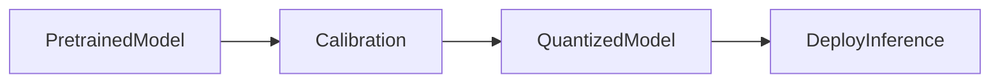

# Post-training quantization (PTQ)

**PTQ** starts from a **fully trained** model. You run **calibration** on representative data to estimate ranges, then **quantize weights** (and sometimes activations) to low bit-widths. The simplest versions need no more training—fast to ship, but some models are picky about accuracy.

1. **Start point**  
   You already have a **pretrained** (or fine-tuned) checkpoint in FP16/BF16 or FP32.

2. **Calibration**  
   Feed a small representative dataset through the model. Observe **activation ranges** or refine **weight ranges** so scales and zero-points reflect real workloads.

3. **Quantize**  
   Apply the symmetric / asymmetric mapping from earlier in this section per tensor or per group. Persist **integer weights + metadata** (scales, zero-points).

4. **Deploy**  
   The **quantized model** loads faster, uses less VRAM, and often runs faster on kernels that support INT8/INT4.

5. **When PTQ is enough**  
   Large, well-regularized models often tolerate INT8 PTQ. Aggressive INT4 on LLMs may need **QAT** or specialized PTQ algorithms (GPTQ, AWQ—beyond these notes).

## Extras

- **Calibration size**: hundreds to thousands of batches; domain mismatch (calibrate on news, deploy on code) hurts.
- **Layer sensitivity**: first/last layers and attention outliers are often kept in higher precision in **mixed** schemes.
- **Weight-only vs weight+activation PTQ**: weight-only is simpler for LLMs; full INT8 GEMMs need well-behaved activations.

## Terms

| Term | Meaning |
|------|---------|
| PTQ | Quantize after training is finished. |
| Calibration | Data pass to estimate quantization ranges. |

Next: [Quantization-aware training (QAT)](05-quantization-aware-training.md) — train while simulating quantization so low-bit weights still work well.
