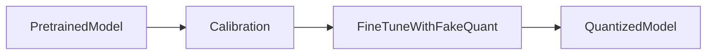

# Quantization-aware training (QAT)

**QAT** runs **fake quantization** during training (or a fine-tune phase) so gradients learn to tolerate rounding. Compared with naive PTQ it often recovers accuracy for aggressive bit widths, at the cost of extra training time.

1. **The problem QAT solves**  
   Naive rounding changes weights in a way the original loss landscape never prepared for. You get a **“loss of accuracy”** because effective weights drift from what training assumed.

2. **Start from a pretrained model**  
   Same entry point as PTQ: a strong FP16/BF16 model.

3. **Calibration / range estimation**  
   Initialize scales like PTQ so fake-quant layers have reasonable bounds.

4. **Fine-tune with quantization in the loop**  
   Forward pass applies **quantize → dequantize** (straight-through estimator or similar) on selected tensors; backward pass updates weights (and sometimes clip ranges) using **domain-specific** or general continuation data.

5. **Export**  
   Produce a **quantized model** that matches deployment kernels.

## Extras

- **Straight-through estimator (STE)**: backward ignores rounding discontinuity; known approximation, works empirically.
- **QAT for LLMs** is less universal than for CNNs on mobile; many LLM deployments use **PTQ + clever formats** instead—but QAT concepts still explain why “just round” fails.
- Combining QAT-style ideas with **LoRA** leads to practical recipes (see **QLoRA** in the QLoRA section).

## Terms

| Term | Meaning |
|------|---------|
| Fake quant | Apply quant/dequant in forward while keeping trainable floats underneath. |
| QAT | Training-time exposure to quantization effects. |

Next: [From base model to specialization](../03-adaptation-and-full-fine-tuning/01-from-base-model-to-specialization.md) — where fine-tuning fits in the product ladder after compression concepts.
