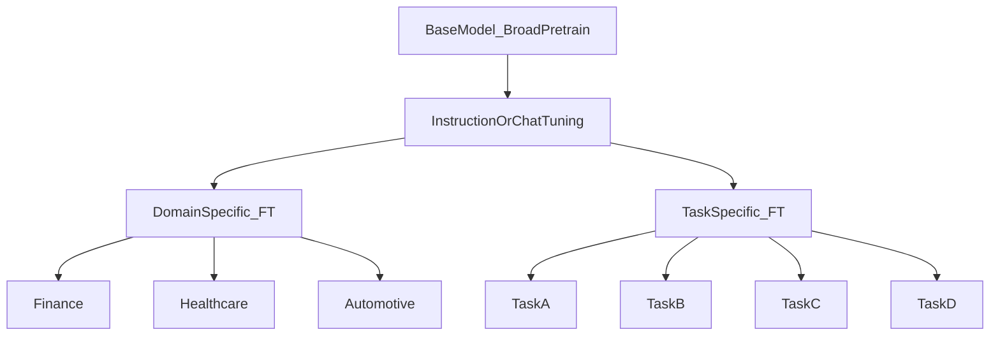

# From base model to specialization

A **base** model from large-scale pre-training becomes useful through **supervised** or **preference** tuning (chat assistants), then branches into **domain** specialization (finance, medicine) or **task** specialization (summaries, extraction, classification-style heads).

1. **Base model**  
   Trained on broad data (Wikipedia-scale mixes, books, web, code). Strong **general** competence.

2. **Instruction / chat alignment (example layer)**  
   Often implemented with **supervised fine-tuning** on high-quality prompt–response pairs, sometimes followed by **RLHF** (RLHF section). Produces models closer to **ChatGPT-style** assistants.

3. **Domain-specific fine-tuning**  
   Same architecture, data focused on one vertical: **healthcare**, **finance**, **automotive** manuals, etc.

4. **Task-specific fine-tuning**  
   Narrow objectives (think A/B/C/D style buckets): e.g. JSON-only output, SQL generation, classification with a head, retrieval reranking.

5. **Why draw the diagram**  
   It clarifies **reuse**: one expensive base supports many downstream products if specialization is cheap enough (PEFT, quantization).

## Extras

- **Multi-stage** pipelines blur lines: you might CPT on domain text, then SFT, then RLHF.
- **Evaluation** should track the target metric and also regressions on general skills (catastrophic forgetting is the usual story).
- **Open vs closed weights**: specialization techniques apply to both; deployment constraints differ.

## Terms

| Term | Meaning |
|------|---------|
| SFT | Supervised fine-tuning on input–output pairs. |
| Domain FT | Fine-tune predominantly on in-domain corpus. |

Next: [Full-parameter fine-tuning](02-full-parameter-fine-tuning.md) — what “train everything” really costs.
