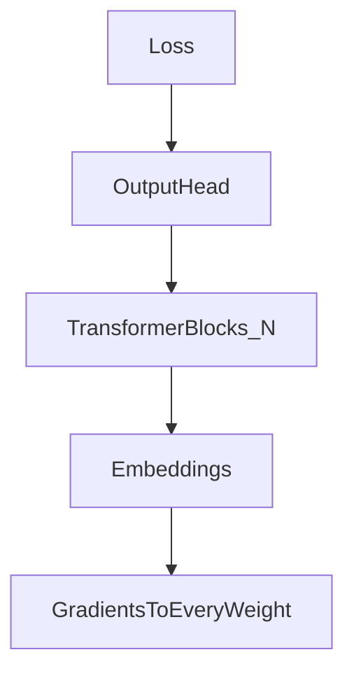

# Full-parameter fine-tuning


**Full-parameter fine-tuning** updates **every weight** in the network. Most flexible adaptation, and the most **memory-hungry**, because optimizers store extra state per parameter during training.

1. **What updates?**  
   All layers: attention projections, MLP matrices, embeddings (unless explicitly frozen), and any output heads.

2. **Why it is expensive**  
   For each trainable scalar, optimizers like Adam keep **extra state** (often two floats per weight). Multiply by **billions** of parameters → a lot of traffic over a run, and a large **GPU RAM** footprint.

3. **Concrete scale intuition**  
   One linear map of shape **4096×4096** is just “4096 rows, each with 4096 learnable knobs,” so the count is:

   ```
   4096 × 4096 = 16,777,216
   ```

   **In words:** about **16.8 million** trainable numbers in **one** projection matrix. A transformer stacks **dozens** of such matrices per layer and tens to hundreds of layers.

4. **When people still do it**  
   If you have budget and need maximum movement of internal representations, or a small model where PEFT overhead is not worth the complexity.

5. **Bridge to LoRA**  
   Empirically, fine-tuning **updates** often sit in a **low-dimensional** subspace—that is the LoRA story (LoRA section).

---



| Matrix | Shape | Approx. parameters |
|--------|-------|---------------------|
| One projection | 4096 × 4096 | ~16.8M |

---

## Extras

- **Sharding** (ZeRO, FSDP) partitions optimizer states across GPUs so full FT of 7B–70B is possible—it is an engineering systems problem, not a math change.
- **Overfitting** risk rises with full FT on small datasets; regularization, early stopping, and PEFT help.
- **Deployment:** many specialized full-FT checkpoints exist; serving cost still tracks model size unless you quantize (the quantization notes) or distill (distillation section).

---

## Terms

| Term | Meaning |
|------|---------|
| Full FT | All weights receive gradient updates. |
| Optimizer state | Extra tensors per parameter for adaptive learning rates. |

Next: [LoRA (low-rank adaptation)](../04-efficient-fine-tuning/01-lora.md) — update a tiny adapter instead of every entry in **W**.
