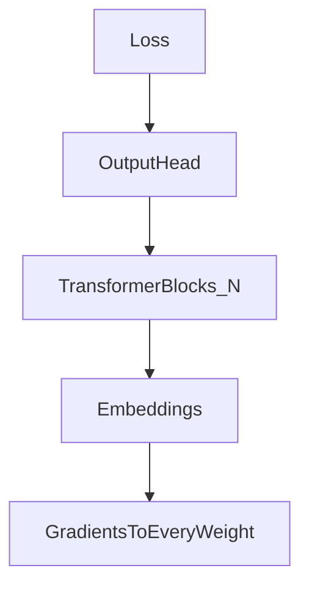

# 08 — Full-parameter fine-tuning

## In one minute

**Full-parameter fine-tuning** updates **every weight** in the network. It is the most flexible form of adaptation—and the most **memory-hungry**, because optimizers store momentum and variance per parameter during training.

## Beginner walkthrough

1. **What updates?**  
   All layers: attention projections, MLP matrices, embeddings (unless explicitly frozen), and any output heads.

2. **Why it is expensive**  
   For each trainable scalar, optimizers like Adam keep **extra state** (often two floats per weight). Multiply by **billions** of parameters → many **terabytes** of aggregate traffic over a run, and large **GPU RAM** footprint.

3. **Concrete scale intuition**  
   One linear weight matrix of shape \(4096 \times 4096\) has  
   \[
   4096 \times 4096 = 16{,}777{,}216
   \]  
   trainable parameters. A transformer has **dozens** of such matrices per layer and tens to hundreds of layers.

4. **When people still do it**  
   If you have budget and need maximum movement of internal representations, or a small model where PEFT overhead is not worth the complexity.

5. **Bridge to LoRA**  
   Empirically, fine-tuning **updates** often lie in a **low-dimensional** subspace—motivating LoRA (folder 09).

## Visuals

**Conceptual backward pass through the full stack**

**Parameter explosion (one matrix)**

| Matrix | Shape | Approx. parameters |
|--------|-------|---------------------|
| One projection | \(4096 \times 4096\) | ~16.8M |

## Going deeper

- **Sharding** (ZeRO, FSDP) partitions optimizer states across GPUs so full FT of 7B–70B is possible—it is an engineering systems problem, not a math change.
- **Overfitting** risk rises with full FT on small datasets; regularization, early stopping, and PEFT help.
- **Deployment**: many specialized full-FT checkpoints exist; serving cost still tracks model size unless you quantize (folders 02–06) or distill (folder 16).

## Mini glossary

| Term | Meaning |
|------|---------|
| Full FT | All weights receive gradient updates. |
| Optimizer state | Extra tensors per parameter for adaptive learning rates. |

## What to read next

**[09 — LoRA (low-rank adaptation)](../04-efficient-fine-tuning/01-lora.md)** — update a tiny adapter instead of every entry in \(W\).
