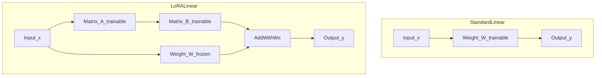

# LoRA (low-rank adaptation)

**Idea in one sentence:** keep the huge matrix **W** fixed, add a **thin** correction **BA** (two small matrices multiplied together), only train **A** and **B**.

---

### Forward pass (what the layer computes)

**Vectors**

- **x** — input column vector, length **d_in** (one token’s hidden size, etc.)

**Matrices**

- **W** — frozen, shape **d_out × d_in**
- **A** — trainable, shape **r × d_in**   (rank **r** is the “bottleneck width”)
- **B** — trainable, shape **d_out × r**

**Output** (same thing written two ways):

```
    y  =  W·x  +  B·A·x          (apply A to x first, then B, then add W·x)

    y  =  (W + B·A)·x            (if you like to think of one big matrix)
```

Only **A** and **B** get gradients.

---

### Why multiply in the order **B (A x)**?

Matrix multiplication needs **inner dimensions** to match:

```
   B            A           x
(d_out × r) × (r × d_in) × (d_in × 1)
      └──── r matches ────┘
                    └── result is (d_out × 1), same shape as W x
```

**Read it left-to-right like a train:**

1. **A** eats **x** → vector length **r**
2. **B** eats that → vector length **d_out**
3. Same length as **W x**, so you can add them

---

### Picture of sizes (W is the fat slab, A and B are thin)

```
  FROZEN (big)                 TRAINABLE (small)
  ─────────────                ─────────────────

       d_in wide
   ┌─────────────────┐
   │                 │
   │        W        │  d_out tall   ← same footprint as B·A below
   │   d_out × d_in  │
   │                 │
   └─────────────────┘

        d_in wide          r wide
   ┌──────────────┐    ┌─────────┐
   │      A       │    │    B    │  d_out tall
   │   r × d_in   │    │ d_out×r │
   └──────────────┘    └─────────┘
         │                  │
         └── A has r rows ──┘
              B has r cols
              (those r’s touch when you multiply B·A)
```

**After you multiply B·A** you get a **d_out × d_in** matrix — same shape as **W** — but it only had **r·(d_in + d_out)** trainable numbers instead of **d_in·d_out**.

---

### Tiny numeric toy (easy to hold in your head)

Suppose **d_in = 100**, **d_out = 100**, **r = 5**.

| piece | shape | how many numbers |
|-------|-------|-------------------|
| W (full fine-tune) | 100×100 | **10 000** |
| A | 5×100 | **500** |
| B | 100×5 | **500** |
| LoRA trainable total | | **1 000** |

So at rank 5 you are touching **10× fewer** weights than full FT for this toy layer (real models are bigger; the ratio gets better when d_in and d_out are huge).

---

### Parameter count (symbolic, but readable)

How many numbers you train with LoRA (order of magnitude):

```
    (# trainable)  ≈  r × d_in  +  r × d_out  =  r × (d_in + d_out)
```

How many numbers live in the full matrix **W**:

```
    (# W entries)  =  d_in × d_out
```

---

### Rank table (still ballpark, real layouts vary)

| Rank r | 7B (order of mag.) | 13B | 70B | 180B |
|:---:|:---:|:---:|:---:|:---:|
| 1 | 167K | 228K | 529K | 849K |
| 2 | 334K | 456K | 1M | 2M |
| 8 | 1M | 2M | 4M | 7M |
| 16 | 3M | 4M | 8M | 14M |
| 512 | 86M | 117M | 270M | 434M |

---



---

## Extras

- **Where to attach LoRA:** usually attention maps W_q, W_k, W_v, W_o, sometimes MLP; skipping biases/embeddings is common.
- **Init:** A small random, B = 0 so BA starts at zero.
- **Scaling:** many libs multiply BA by α/r.
- **Inference merge:** bake W̃ = W + BA into one matmul when you ship.

---

## Terms

| Term | Meaning |
|------|---------|
| Rank r | Inner bottleneck size between A and B. |
| Adapter (LoRA sense) | Trainable (A, B) pair next to frozen W. |

Next: [QLoRA](02-qlora.md) — same math, but W lives in low bits in memory.
