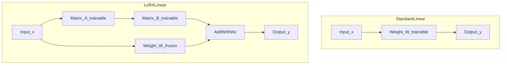

# 09 — LoRA (low-rank adaptation)

## In one minute

**LoRA** freezes the original weight matrix \(W\) and learns a **small** update \(\Delta W \approx B A\) where \(B\) and \(A\) are thin matrices. The forward pass becomes \(y = (W + BA)x\). You train only \(A\) and \(B\), so memory and compute for adaptation drop sharply versus full fine-tuning.

## Beginner walkthrough

1. **Problem restated**  
   Full fine-tuning updates every entry of huge matrices (folder 08). Many observed **fine-tuning directions** are correlated and **low-dimensional**.

2. **Hypothesis**  
   You may not need an arbitrary full-rank \(\Delta W\); a **low-rank** product \(BA\) can approximate the useful part of the update.

3. **Shapes**  
   If \(W\) has shape \((d_{\text{out}} \times d_{\text{in}})\), choose rank \(r \ll \min(d_{\text{in}}, d_{\text{out}})\).  
   - \(A\) is \((r \times d_{\text{in}})\)  
   - \(B\) is \((d_{\text{out}} \times r)\)  
   Then \(BA\) is \((d_{\text{out}} \times d_{\text{in}})\), same as \(W\): **same input and output dimensions** as the original layer.

4. **Forward pass**  
   - Standard: \(y = W x\)  
   - LoRA: \(y = (W + BA)x\) with **\(W\) frozen**; gradients flow into **\(A\)** and **\(B\)**.

5. **Parameter savings**  
   Trainable count \(\approx r(d_{\text{in}} + d_{\text{out}})\) instead of \(d_{\text{in}} d_{\text{out}}\).

6. **Rank table (illustrative scale from study notes)**  

| Rank \(r\) | 7B model (order of mag.) | 13B | 70B | 180B |
|:---:|:---:|:---:|:---:|:---:|
| 1 | 167K | 228K | 529K | 849K |
| 2 | 334K | 456K | 1M | 2M |
| 8 | 1M | 2M | 4M | 7M |
| 16 | 3M | 4M | 8M | 14M |
| 512 | 86M | 117M | 270M | 434M |

Exact totals depend on **which layers** you attach LoRA to and architecture hyperparameters; use the table for intuition: small \(r\) → very few trainable parameters.

## Visuals

**Standard vs LoRA linear layer**



**Low-rank product sketch (ASCII)**

```
B is (d_out x r)     A is (r x d_in)

     [==== r ====]        [==== d_in ====]
d_out|             |  x   |                |  =  d_out x d_in
     |             |      |                |
     [=============]        [================]
```

## Going deeper

- **Where to attach LoRA**: usually **attention projections** (\(W_q, W_k, W_v, W_o\)) and sometimes MLP; skipping all bias and embeddings is common.
- **Initialization**: often \(A\) random small, \(B\) zero so initial \(\Delta W = 0\).
- **Scaling**: implementations use a factor \(\alpha/r\) on \(BA\) to tune effective step size.
- **Inference merge**: at deployment, \(\tilde{W} = W + BA\) can be **fused** for one matmul—no runtime LoRA overhead if you merge per deployment target.

## Mini glossary

| Term | Meaning |
|------|---------|
| Rank \(r\) | Inner dimension of the low-rank factorization. |
| Adapter (LoRA sense) | Trainable \(A,B\) pair attached to a frozen \(W\). |

## What to read next

**[10 — QLoRA](02-qlora.md)** — keep the giant \(W\) in very low precision in memory, still train \(A\) and \(B\) in higher precision.
