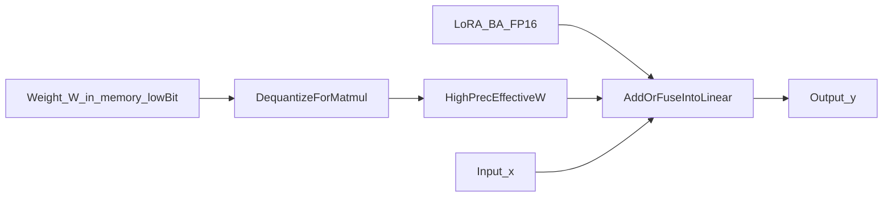
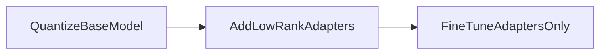

# 10 — QLoRA (quantized LoRA)

## In one minute

**QLoRA** is LoRA plus **quantized frozen base weights**: the big matrix \(W\) is stored in **4-bit** (or similar) for memory savings, while the small LoRA matrices \(A\) and \(B\) stay in **FP16/BF16** for stable training. At compute time, \(W\) is **dequantized** to a higher precision so it can be combined with \(BA\).

## Beginner walkthrough

1. **Motivation**  
   Even with LoRA, loading a 70B model in FP16 for training is painful. **Quantizing only the frozen backbone** shrinks memory a lot.

2. **Pipeline (conceptual)**  
   - **Quantize** the frozen weight matrix \(W\) to a low-bit representation \(W_q\) with metadata (block scales, etc., depending on implementation).  
   - **Attach** LoRA matrices \(A,B\).  
   - **Train** only \(A,B\) (and sometimes norms), not every entry of \(W\).

3. **Why not quantize \(A\) and \(B\)?**  
   They are **small** and **actively changing**; keeping them in FP16/BF16 avoids unnecessary noise in gradients. The memory win from 4-bitting them is minor compared to the base.

4. **Mixed dtypes in \(y = (W + BA)x\)**  
   You cannot meaningfully add int4 storage to FP16 tensors directly. Implementations **dequantize** \(W_q \rightarrow \tilde{W}\) in FP16/BF32 for the matmul, then add \(BA x\) in that precision path (exact details depend on kernels).

5. **Three-step story (matches study notes)**  
   Quantize base → add low-rank adapters → fine-tune **adapters only**.

## Visuals

**Storage vs compute**

**QLoRA recipe (bubbles)**

## Going deeper

- **NF4 and double quant** (original QLoRA paper): non-uniform 4-bit levels and compressed scale tensors—your notes focus on the idea, not every format bit.
- **Paged optimizers** and **gradient checkpointing** pair with QLoRA to fit large models on one GPU.
- **Accuracy**: QLoRA can match 16-bit LoRA on many benchmarks when hyperparameters are sane—still validate on **your** task.

## Mini glossary

| Term | Meaning |
|------|---------|
| Dequantization | Reconstruct approximate FP values from low-bit codes + scales. |
| QLoRA | Quantized backbone + LoRA adapters for memory-efficient FT. |

## What to read next

**[11 — PEFT overview](03-peft-overview.md)** — LoRA/QLoRA as instances of a broader “train less of the model” philosophy.
