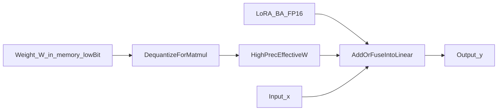
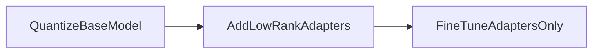

# QLoRA (quantized LoRA)

**Idea in one sentence:** same LoRA math (**y ≈ Wx + BAx**), but the frozen **W** is **packed in 4-bit** (or similar) in VRAM; **A** and **B** stay in FP16/BF16 so training stays stable. Right before the matmul, **W** is **dequantized** back to a usable float matrix.

---

### The math you are still doing

```
    y  =  W_tilde · x  +  B · A · x
```

- **W_q** — what is actually in memory (low-bit codes + scale metadata)
- **W_tilde** (same idea as “W̃”) — short-lived float view of W built from W_q for this matmul
- **A, B** — same shapes as plain LoRA: **r×d_in** and **d_out×r**

So the **shape picture** is identical to the LoRA note; only **where W lives** changes.

---

### Memory vs compute (two different stories)

```
┌─────────────────────────────────────────────────────────────┐
│  MEMORY (what sits on the GPU during training)              │
├─────────────────────────────────────────────────────────────┤
│  W_q   : 4-bit (or int8) codes + scales      ← cheap        │
│  A, B  : FP16 / BF16                         ← small anyway │
└─────────────────────────────────────────────────────────────┘

┌─────────────────────────────────────────────────────────────┐
│  COMPUTE (what one linear forward roughly does)             │
├─────────────────────────────────────────────────────────────┤
│  W_q  ──dequant──►  W_tilde  ──@x──►  (add)  ◄── B @ A @ x  │
│                     FP16/BF32              same dtype path  │
└─────────────────────────────────────────────────────────────┘
```

You **do not** literally add int4 to float16. You **expand** W_q → W̃, then do normal linear algebra.

---

### Multiply order (same as LoRA, repeated on purpose)

```
   W_tilde        x          B          A          x
(d_out × d_in) × (d_in×1) + (d_out×r)×(r×d_in)×(d_in×1)
```

First branch: **W̃ x** → length d_out  
Second branch: **B(Ax)** — **Ax** is length **r**, then **B** blows it back to **d_out**.

---

### Pipeline checklist

1. **Quantize** frozen W → **W_q** (+ block scales, library-specific).
2. **Attach** LoRA matrices **A, B** (FP16/BF16).
3. **Train** only **A, B** (and sometimes norms).

---

### Why I do not bother quantizing A and B

They are **small** and **change every step**; low-bit them and you mostly inject noise into gradients. The VRAM win is almost all from squishing **W**.

---

### Three-step story (mental model)

Quantize base → add low-rank adapters → fine-tune **adapters only**.

---





---

## Extras

- **NF4 + double quant** (QLoRA paper): fancier 4-bit levels + compressed scales—I only care about the idea here, not every bit layout.
- **Paged optimizers** + **gradient checkpointing** are the usual friends for one-GPU runs.
- **Accuracy:** often close to FP16 LoRA on public benchmarks when hyperparameters are sane—still validate on the task you care about.

---

## Terms

| Term | Meaning |
|------|---------|
| Dequantization | Rebuild approximate floats from low-bit codes + scales. |
| QLoRA | Quantized backbone + LoRA adapters for memory-efficient FT. |

Next: [PEFT overview](03-peft-overview.md) — LoRA/QLoRA as “train less of the model.”
