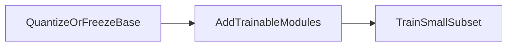
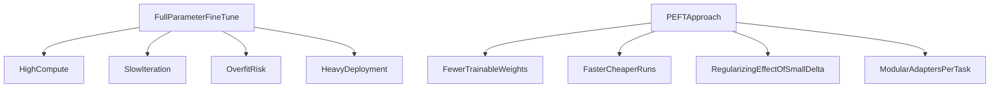

# PEFT (parameter-efficient fine-tuning) overview

**PEFT** adapts a huge pretrained model by updating **only a small fraction** of parameters (or small added modules), leaving the backbone frozen or mostly frozen. That cuts training cost, often reduces overfitting on tiny domain sets, and makes serving many variants easier than shipping full-weight copies for every flavor.

1. **Definition**  
   Fine-tune large pretrained LLMs for a specific task by training **a small subset** of parameters or **small trainable layers**, while the rest stays fixed.

2. **How PEFT works (three steps)**  
   1. Start from a **pretrained** model (BERT, GPT, T5, Llama, etc.).  
   2. **Freeze** the core weights so general knowledge stays put.  
   3. **Add** task-specific trainable pieces (LoRA, adapters, soft prompts, …) and train those.

3. **QLoRA-style workflow in one glance**  
   Quantize base weights for memory → add adapters → train adapters (same idea as QLoRA).

4. **Problems with traditional full fine-tuning** (why PEFT exists)  
   1. **Resource intensity** — updates all parameters; needs heavy hardware and budget.  
   2. **Efficiency** — slow and expensive to iterate many specialties.  
   3. **Overfitting** — small domain datasets can distort a huge model.  
   4. **Deployment** — many full-weight copies are bulky; many small adapters are easier to swap or batch.

## Extras

- **Orthogonality**: PEFT reduces **optimizer state** cost, not always **peak activation memory**—large batch inference still needs big activations unless you also quantize inference or use distillation.
- **Multi-adapter routing**: serving systems can pick adapter ID per request; research into merging adapters is active.
- **PEFT + RLHF**: preference tuning can be done on adapters instead of full weights when objectives allow.

## Terms

| Term | Meaning |
|------|---------|
| PEFT | Parameter-efficient fine-tuning family. |
| Frozen backbone | Base weights not updated by gradient descent. |

Next: [PEFT methods overview](04-peft-methods-overview.md) — map of techniques beyond LoRA alone.
