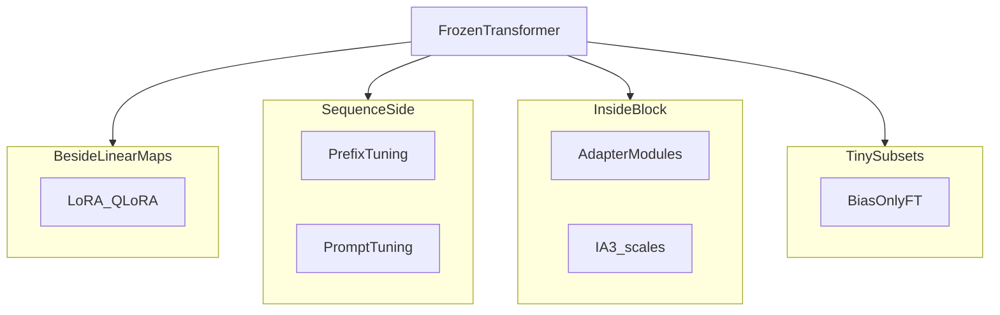

# PEFT methods overview

PEFT is a **menu** of tricks: some train **small matrices** next to linear layers (LoRA), some train **prefixes** or **virtual tokens**, some insert **adapter MLPs**, some only tune **biases** or **scale vectors**. Pick based on memory, latency, and how invasive you can be.

1. **LoRA / QLoRA** — low-rank deltas on selected projections; QLoRA quantizes frozen weights ([LoRA](01-lora.md), [QLoRA](02-qlora.md)).

2. **Prefix tuning** — learn continuous **prefix hidden states** prepended to each layer’s keys/values; affects attention context without changing word embeddings directly.

3. **Prompt tuning (soft prompts)** — learn a small bank of **virtual tokens** embedded at the input; frozen model reads them like extra context.

4. **Adapter modules** — small **bottleneck MLPs** inserted between transformer sublayers; train adapters only ([adapters](05-adapter-modules.md)).

5. **Bias-term fine-tuning** — update only **bias vectors**; extremely cheap but limited expressivity.

6. **(IA)³** — **Infused Adapter by Inhibiting and Amplifying Inner Activations**; learn **per-channel rescale** parameters on inner activations (often intermediate states of attention/FFN) with very few parameters.

7. **How to choose (rule of thumb)**  
   - Need strong adaptation + good libraries: **LoRA/QLoRA**.  
   - Need minimal added latency at inference after merge: **LoRA merge** or **prompt tuning** (if sequence budget allows).  
   - Research / modular multi-task: **adapters**.

## Extras

- **Latency**: adapters add extra subforward passes unless fused or merged; prompt/prefix methods lengthen **sequence length** (KV cache cost).
- **Composition**: multiple PEFT methods can combine in research settings; production usually picks one primary mechanism.
- **Hardware**: INT8/FP8 inference kernels may or may not exist for exotic adapter layouts—validate on target chips.

## Terms

| Term | Meaning |
|------|---------|
| Soft prompt | Learned embedding vectors prepended to inputs. |
| Adapter | Small trainable subnetwork between layers. |

Next: [Adapter modules](05-adapter-modules.md) — classic bottleneck adapters in more detail.
