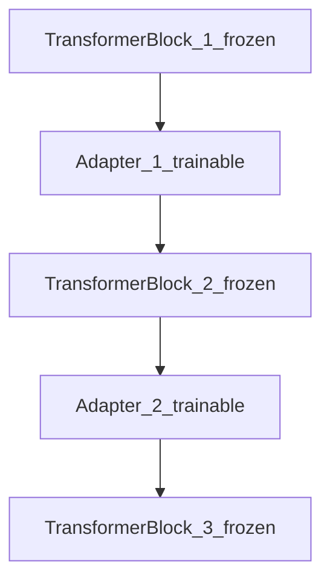
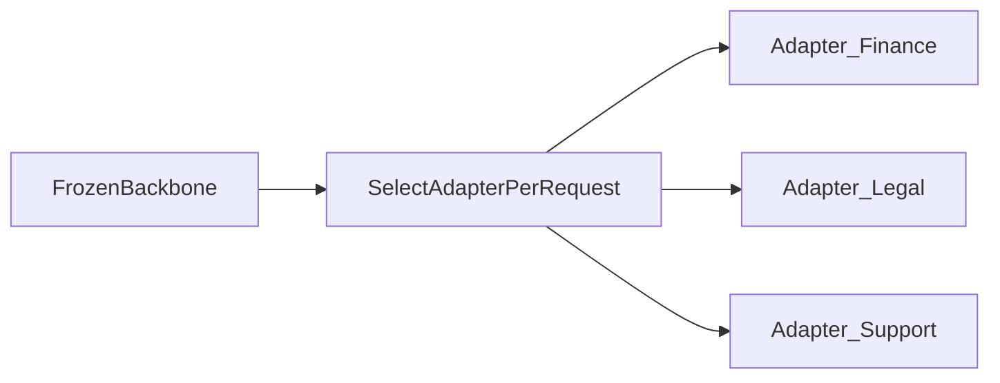

# 13 — Adapter modules

## In one minute

**Adapter modules** are small neural networks (often a **down-project → nonlinearity → up-project** bottleneck) inserted **between** existing transformer layers or sublayers. During fine-tuning, **only adapters train**; the pretrained backbone stays frozen.

## Beginner walkthrough

1. **Placement**  
   Typical pattern: after attention, after MLP, or parallel branches inside a block—exact wiring varies by paper (Houlsby-style, Pfeiffer-style, etc.).

2. **Training**  
   Forward pass runs frozen transformer + adapter residuals. Backprop updates **adapter weights only** (plus layer norm if unfrozen).

3. **Why it helps**  
   Adds capacity for **task-specific transforms** without overwriting the entire representation basis learned at pretraining.

4. **Multi-task learning**  
   Keep one backbone checkpoint; train **different adapter sets** per task or customer. At inference, **select adapter A/B/C** for the active task.

5. **Comparison to LoRA**  
   LoRA is a **linear low-rank** side path on existing projections; adapters are usually **nonlinear MLP bottlenecks** with their own parameters. Both are PEFT.

## Visuals

**Adapters between transformer blocks (conceptual)**

**Multi-task routing**

## Going deeper

- **Parameter count vs latency**: adapters add **extra FLOPs** each forward unless merged/distilled away.
- **Stability**: bottleneck dimension controls expressivity; too wide → closer to full FT behavior.
- **With quantization**: you can quantize backbone + FP16 adapters similarly to QLoRA spirit, but engineering differs from library defaults.

## Mini glossary

| Term | Meaning |
|------|---------|
| Bottleneck | Small hidden dimension forces compact representation. |
| Residual adapter | Adapter output added into the residual stream of the block. |

## What to read next

**[14 — RLHF](../05-post-training-alignment/01-reinforcement-learning-from-human-feedback.md)** — align behavior using human preference signals instead of only next-token loss.
