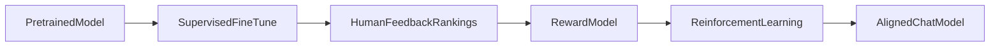
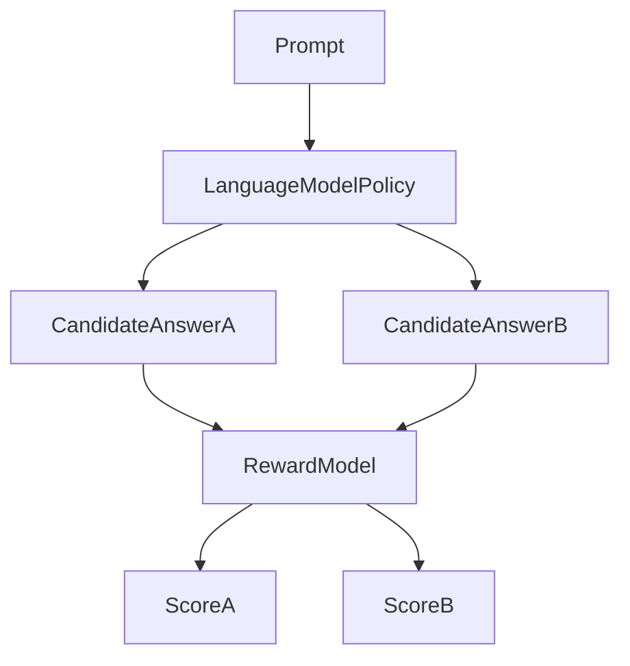

# 14 — Reinforcement learning from human feedback (RLHF)

## In one minute

**RLHF** turns **human preferences** into a training signal: people compare model answers, a **reward model** learns to score quality and safety, then **reinforcement learning** nudges the language model policy toward higher reward—producing assistants that are more **helpful**, **honest**, and **harmless** in expectation.

## Beginner walkthrough

1. **Pretraining**  
   Self-supervised base model (folder 01).

2. **Supervised fine-tuning (SFT)**  
   Train on curated **prompt–answer** demonstrations so the model learns a basic chat format and task breadth.

3. **Human ranking**  
   For the same prompt, the model generates **multiple candidate answers**. Humans **rank** which answers are better (clarity, factuality, tone, safety).

4. **Reward model (RM)**  
   Another network learns from ranking data to output a **scalar reward** predicting human preference. It encodes “what good looks like” for a prompt–response pair.

5. **Reinforcement learning on the policy**  
   Optimize the language model to **maximize expected reward** (often with a **KL penalty** to the SFT model so it does not collapse into reward hacking or gibberish). Algorithms such as **PPO** are common historically; **DPO/ORPO** and other preference optimization objectives are modern alternatives that skip explicit RL in some setups.

6. **Output**  
   An **aligned chat model** suitable for user-facing deployment—still not perfect; safety is iterative.

## Visuals

**End-to-end pipeline**

**What the reward model does (conceptual)**

## Going deeper

- **Reward hacking**: policy exploits loopholes in RM; mitigations include **KL to reference**, better RM data, adversarial audits, and **constitutional** or **RLAIF** variants.
- **Preference modeling math**: pairwise ranking implies a **Bradley–Terry** or **Plackett–Luce** style loss for RM training.
- **PEFT + alignment**: LoRA adapters can be the trainable policy parameters during RLHF-style stages to save memory.

## Mini glossary

| Term | Meaning |
|------|---------|
| Policy | The language model that generates tokens. |
| Reward model | Scorer trained from human rankings. |
| KL penalty | Keeps updated policy near trusted reference. |

## What to read next

**[15 — Catastrophic forgetting](02-catastrophic-forgetting.md)** — why aggressive fine-tuning can erase skills you still care about.
