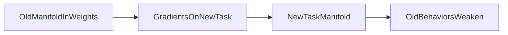

# 15 — Catastrophic forgetting

## In one minute

**Catastrophic forgetting** means the model gets **better on the new training distribution** but **worse on what it used to do well**, because gradient updates **overwrite** representations that supported old skills.

## Beginner walkthrough

1. **Example (from study notes)**  
   - **Before fine-tuning:** strong at coding, reasoning, and chat.  
   - **After heavy fine-tune on medical data:** excellent medical answers, but **coding quality drops**.

2. **Mechanism (training-time)**  
   - Gradients **update weights** to reduce loss on new batches.  
   - New data **pushes** weights toward patterns that fit the new domain.  
   - If updates are **large** or data is **narrow**, regions of weight space that encoded old behavior are **erased or repurposed**.

3. **Why LoRA / PEFT helps (not a magic cure)**  
   Freezing **\(W\)** and training only **\(A,B\)** (or adapters) limits how much the base representation can move, reducing destructive interference—though adapters can still bias outputs away from old behaviors if pushed hard.

4. **Mitigations beyond PEFT**  
   Mix **replay** of general data with domain data; use **smaller learning rates**; **early stopping**; **multi-task** objectives; **regularization** toward the base model (EWC-style methods in research).

## Visuals

**Before vs after specialization (ASCII)**

```
Before FT:   [ coding ████████ ][ reasoning ██████ ][ chat ██████ ]

After narrow domain FT:
             [ medical ██████████ ][ coding ██ ][ reasoning ██ ]
```

**Gradient updates as overwriting**



## Going deeper

- **Evaluation suites** (MMLU subsets, coding benchmarks, safety red-team sets) are how teams catch regressions early.
- **Catastrophic** is somewhat dramatic wording; in practice degradation can be smooth—but the risk is real on small datasets.
- **RLHF** can also shift capabilities; monitoring **win-rate vs baselines** across task families is standard.

## Mini glossary

| Term | Meaning |
|------|---------|
| Forgetting | Performance drop on previously learned behaviors. |
| Replay | Mix old-domain minibatches into new training. |

## What to read next

**[16 — LLM distillation](03-llm-distillation.md)** — compress knowledge from a large teacher into a smaller student.
