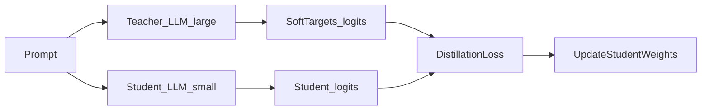
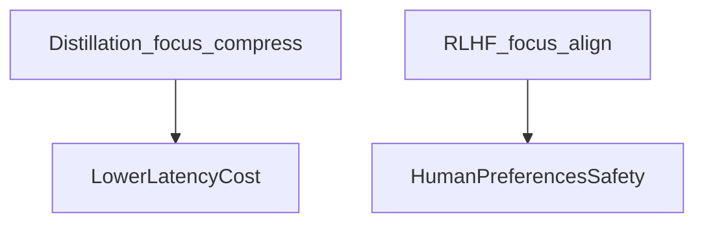

# 16 — LLM distillation

## In one minute

**Distillation** trains a smaller **student** model to imitate a larger **teacher** model (or a stronger checkpoint) using the teacher’s **soft probabilities** or **hidden states**, not only hard labels. Goal: **cheaper inference** with acceptable quality—not the same objective as RLHF, though both are post-training tools.

## Beginner walkthrough

1. **Teacher forward**  
   Run the big model on training prompts. Capture **logits** \(z_T\) over the vocabulary (possibly temperature-scaled).

2. **Student forward**  
   Run the small model, get logits \(z_S\).

3. **Distillation loss**  
   Common term: **KL divergence** between softened teacher distribution and student distribution on each token (plus optional standard cross-entropy to ground truth tokens).

4. **Why it differs from RLHF**  
   - Distillation: “**match a teacher’s behavior distribution**” for compression or speed.  
   - RLHF: “**optimize human preference scores**” for alignment.  
   They can be combined in complex pipelines but solve different primary problems.

5. **Variants**  
   **Sequence-level** distillation (imitate rationales), **feature distillation** (match intermediate representations), **on-policy** distillation from teacher samples.

## Visuals

**Teacher → student**

**Positioning (high level)**

## Going deeper

- **Capacity gap**: if the student is too small, it cannot fit the teacher distribution—curriculum and task narrowing help.
- **Data efficiency**: distillation can use **unlabeled** prompts if teacher provides targets; quality depends on teacher biases.
- **Legal/ethical**: cloning proprietary teachers without permission is a policy issue, not just a technical one.

## Mini glossary

| Term | Meaning |
|------|---------|
| Soft targets | Probability vector over tokens from teacher softmax. |
| Student | Smaller model being trained to imitate teacher. |

## What to read next

You have reached the end of this linear path. Revisit the **[curriculum index](../README.md)** or loop back to **[01](../01-introduction/01-pre-training-and-fine-tuning.md)** for a second pass with the *Going deeper* sections.
