# LLM fine-tuning and efficient training — study path

Text-only notes in **Markdown**, grouped into **five theme folders** (fewer top-level items than 16 separate chapters). The **reading order is still linear**: follow the table from top to bottom across folders.

Each note uses the same structure: **In one minute** → **Beginner walkthrough** → **Visuals** → **Going deeper** → **Mini glossary** → **What to read next**.

**How to use this repo**

- **First pass:** read only the *In one minute* section in each note, in table order.
- **Second pass:** read the full walkthroughs and diagrams.
- **Advanced skim:** jump to *Going deeper* after glancing at visuals.

No scanned images are stored here; diagrams are **Mermaid** (renders on GitHub) and simple **ASCII** where a number line is clearer.

---

## Theme folders (what goes where)

| Folder | Topics |
|--------|--------|
| [01-introduction](01-introduction/) | Pre-training vs fine-tuning |
| [02-quantization](02-quantization/) | Overview → symmetric / asymmetric → PTQ → QAT |
| [03-adaptation-and-full-fine-tuning](03-adaptation-and-full-fine-tuning/) | Base model ladder → full-parameter fine-tuning |
| [04-efficient-fine-tuning](04-efficient-fine-tuning/) | LoRA, QLoRA, PEFT survey, adapters |
| [05-post-training-alignment](05-post-training-alignment/) | RLHF, catastrophic forgetting, distillation |

---

## Curriculum map

```mermaid
flowchart LR
  subgraph quant [02-quantization]
    q1[01_overview]
    q2[02_symmetric]
    q3[03_asymmetric]
    q4[04_PTQ]
    q5[05_QAT]
  end
  subgraph adapt [03-adaptation-and-full-FT]
    a1[01_specialization]
    a2[02_full_FT]
  end
  subgraph efft [04-efficient-FT]
    e1[01_LoRA]
    e2[02_QLoRA]
    e3[03_PEFT]
    e4[04_methods]
    e5[05_adapters]
  end
  subgraph align [05-post-training-alignment]
    r1[01_RLHF]
    r2[02_forgetting]
    r3[03_distill]
  end
  intro[01-introduction] --> q1
  q1 --> q2 --> q3 --> q4 --> q5
  q5 --> a1 --> a2
  a2 --> e1 --> e2 --> e3 --> e4 --> e5
  e5 --> r1 --> r2 --> r3
```

---

## Learning path (read in this order)

| # | Section | Note | You will learn |
|---|---------|------|----------------|
| 1 | Introduction | [01-pre-training-and-fine-tuning](01-introduction/01-pre-training-and-fine-tuning.md) | From raw data and self-supervision to a base model, then task/domain adaptation. |
| 2 | Quantization | [01-overview](02-quantization/01-overview.md) | Why lower-bit weights and activations exist, and what you trade off. |
| 3 | Quantization | [02-symmetric-quantization](02-quantization/02-symmetric-quantization.md) | Min–max range, scale factor, mapping floats to integer bins (symmetric case). |
| 4 | Quantization | [03-asymmetric-quantization](02-quantization/03-asymmetric-quantization.md) | Zero-point when real values are not symmetric around zero. |
| 5 | Quantization | [04-post-training-quantization-ptq](02-quantization/04-post-training-quantization-ptq.md) | Quantize a finished model after calibration. |
| 6 | Quantization | [05-quantization-aware-training](02-quantization/05-quantization-aware-training.md) | Train with quantization in the loop for better low-bit accuracy. |
| 7 | Adaptation | [01-from-base-model-to-specialization](03-adaptation-and-full-fine-tuning/01-from-base-model-to-specialization.md) | Base → chat-style → domain vs task specialization. |
| 8 | Adaptation | [02-full-parameter-fine-tuning](03-adaptation-and-full-fine-tuning/02-full-parameter-fine-tuning.md) | Updating every weight: cost and when it is still used. |
| 9 | Efficient FT | [01-lora](04-efficient-fine-tuning/01-lora.md) | Low-rank adapters, \(y=(W+BA)x\), rank and parameter counts. |
| 10 | Efficient FT | [02-qlora](04-efficient-fine-tuning/02-qlora.md) | Quantized base weights plus LoRA adapters and dequantization at compute. |
| 11 | Efficient FT | [03-peft-overview](04-efficient-fine-tuning/03-peft-overview.md) | Parameter-efficient fine-tuning and limits of full fine-tuning. |
| 12 | Efficient FT | [04-peft-methods-overview](04-efficient-fine-tuning/04-peft-methods-overview.md) | Survey: prefix, prompt, adapters, bias, (IA)³, LoRA/QLoRA pointers. |
| 13 | Efficient FT | [05-adapter-modules](04-efficient-fine-tuning/05-adapter-modules.md) | Small inserted layers; multi-task via different adapters. |
| 14 | Alignment | [01-reinforcement-learning-from-human-feedback](05-post-training-alignment/01-reinforcement-learning-from-human-feedback.md) | Preference data, reward model, policy optimization for alignment. |
| 15 | Alignment | [02-catastrophic-forgetting](05-post-training-alignment/02-catastrophic-forgetting.md) | Why new training can erase old behavior; link to freezing and adapters. |
| 16 | Alignment | [03-llm-distillation](05-post-training-alignment/03-llm-distillation.md) | Teacher–student compression and how it differs from RLHF-style alignment. |

Start here: **[01-pre-training-and-fine-tuning](01-introduction/01-pre-training-and-fine-tuning.md)**
