```mermaid
flowchart LR
  subgraph quant [02-quantization]
    q1[01_overview]
    q2[02_symmetric]
    q3[03_asymmetric]
    q4[04_PTQ]
    q5[05_QAT]
  end
  subgraph adapt [03-adaptation-and-full-FT]
    a1[01_specialization]
    a2[02_full_FT]
  end
  subgraph efft [04-efficient-FT]
    e1[01_LoRA]
    e2[02_QLoRA]
    e3[03_PEFT]
    e4[04_methods]
    e5[05_adapters]
  end
  subgraph align [05-post-training-alignment]
    r1[01_RLHF]
    r2[02_forgetting]
    r3[03_distill]
  end
  intro[01-introduction] --> q1
  q1 --> q2 --> q3 --> q4 --> q5
  q5 --> a1 --> a2
  a2 --> e1 --> e2 --> e3 --> e4 --> e5
  e5 --> r1 --> r2 --> r3
```

# LLM fine-tuning and efficient training

Personal notes in Markdown. I grouped them into five folders so the tree is not a flat wall of sixteen files; the order below is still the order I read them in.

Diagrams are Mermaid where GitHub renders them, plus ASCII where a sketch is faster than prose. **Quantization + LoRA notes use plain fractions and code blocks on purpose** so they read the same in Cursor, Obsidian, and print—no LaTeX you have to mentally compile.

---

## Where things live

| Folder | What is in there |
|--------|------------------|
| [01-introduction](01-introduction/) | Pre-training vs fine-tuning |
| [02-quantization](02-quantization/) | Overview through PTQ and QAT |
| [03-adaptation-and-full-fine-tuning](03-adaptation-and-full-fine-tuning/) | Base model ladder, then full-parameter fine-tuning |
| [04-efficient-fine-tuning](04-efficient-fine-tuning/) | LoRA, QLoRA, PEFT, adapters |
| [05-post-training-alignment](05-post-training-alignment/) | RLHF, forgetting, distillation |

**Runnable lab (LoRA + FUNPANG data):** [labs/medical_lora/README.md](labs/medical_lora/README.md) — Meta Llama 3.2 3B, M2/16 GB–friendly defaults, before/after compare script.

---

## Map (same order as the table)

---

## Reading order

| # | Topic | File |
|---|--------|------|
| 1 | Introduction | [01-pre-training-and-fine-tuning](01-introduction/01-pre-training-and-fine-tuning.md) |
| 2 | Quantization | [01-overview](02-quantization/01-overview.md) |
| 3 | Quantization | [02-symmetric-quantization](02-quantization/02-symmetric-quantization.md) |
| 4 | Quantization | [03-asymmetric-quantization](02-quantization/03-asymmetric-quantization.md) |
| 5 | Quantization | [04-post-training-quantization-ptq](02-quantization/04-post-training-quantization-ptq.md) |
| 6 | Quantization | [05-quantization-aware-training](02-quantization/05-quantization-aware-training.md) |
| 7 | Adaptation | [01-from-base-model-to-specialization](03-adaptation-and-full-fine-tuning/01-from-base-model-to-specialization.md) |
| 8 | Adaptation | [02-full-parameter-fine-tuning](03-adaptation-and-full-fine-tuning/02-full-parameter-fine-tuning.md) |
| 9 | Efficient FT | [01-lora](04-efficient-fine-tuning/01-lora.md) |
| 10 | Efficient FT | [02-qlora](04-efficient-fine-tuning/02-qlora.md) |
| 11 | Efficient FT | [03-peft-overview](04-efficient-fine-tuning/03-peft-overview.md) |
| 12 | Efficient FT | [04-peft-methods-overview](04-efficient-fine-tuning/04-peft-methods-overview.md) |
| 13 | Efficient FT | [05-adapter-modules](04-efficient-fine-tuning/05-adapter-modules.md) |
| 14 | Alignment | [01-reinforcement-learning-from-human-feedback](05-post-training-alignment/01-reinforcement-learning-from-human-feedback.md) |
| 15 | Alignment | [02-catastrophic-forgetting](05-post-training-alignment/02-catastrophic-forgetting.md) |
| 16 | Alignment | [03-llm-distillation](05-post-training-alignment/03-llm-distillation.md) |

Start: [01-pre-training-and-fine-tuning](01-introduction/01-pre-training-and-fine-tuning.md)
